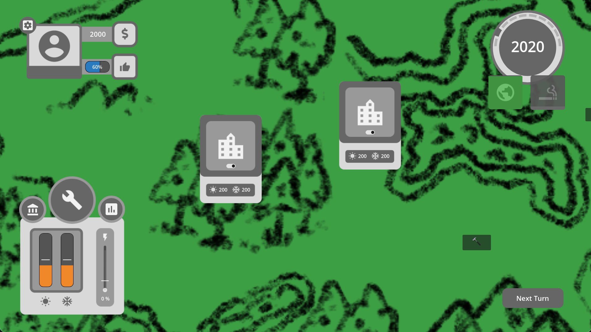

# Amelia Dobis - Notable Projects  
Updated: 09.06.2023  
  
*******************************************************  
  
## Structure  

This portfolio contains all of my notable projects grouped into the following categories:  
 - Video Game Development  
 - Compupter Graphics and Vision    
 - Verification & Compiler Engineering  
 - Systems Programming & Hardware Development   

In each part, I highlight the impoprtant projects that I worked on in that field, both alone and in teams.   
Projects in each subject are ordered chronologically and cover Software and Hardware Research and Engineering work done over the past 10 years. 
  
## Table of Contents  

 1. __Video Game Development__   
    - [Ensured: A sustainable developmnent tycoon]()  
    - [Hammered]()  
    - [Lausanne 1830: Stories in History]()  
    - [Four Condos and a Containment]()
    - [Theory of Human Demotivation]()  
    - [NCurses-Pong]()  
    - [Capture the flag NDS]()  
    - [Permafrost Tilter]()  

 2. __Computer Graphics & Vision__  
    - [Building an Interactive 3D Modeling Application]()  
    - [Nori: A Physically Based Renderer]()  
    - [Position Based Fluids]()  
    - [A Modern Approach to Road Segmentation]()  
    - [Real-Time Rendering of Dielectric Materials]()  
   
3. __Verification & Compiler Engineering__  
    - [Grammar-based Exhaustive Testing of JSON validation]()  
    - [ChiselVerify: A Hardware Verification Library for Chisel]()  
    - [Functional-Coverage Guided Fuzzing for Chisel Designs]()
    - [Implementing L3, a Lisp-Like-Language]()  
    - [Permission-Based Formal Verification with Viper]()
       
4. __Systems Programming & Hardware Development__  
    - [OpenMP Tasking Backend for the DaCe framework]()  
    - [High Performance Code Generation for Floyd Warshall]()  
    - [DRAM Memory Request Scheduling Simulator for Champsim]()
    - [Multi-Core cache-coherent Processor Simulator]()
    - [Accelerating Ray-Tracing on FPGA]()  
    - [5-Stage Pipelined NIOSII Processor Implementation]()
    - [Gameboj - a Gameboy Emulator]()  

*******************************************************  
  
## Video Game Development    
  
### Ensured: A sustainable developmnent tycoon  
 - __Date: June 2023 - Present__  
 - __Associated Role:__ Full-Time Software Engineer at USI
   
    #### Context  
     In the scope of the [SWEET SURE: Sustainable and Resilient Energy for Switzerland](https://sweet-sure.ch/) project, which is funded by the Swiss Confederation and is a collaboration between various research institutions, we have been tasked by the Università della Svizzera Italiana (USI)'s Euler Institute to create a video game illustrating the difficult dicisions that must be made to achieve net zero carbon emissions by 2050. For this project we are a core team of 3 people for the video game itself (a developer, a game designer, and an artist), as well as one post-doc working on the energy grid simulation backend, a team of political scientists at the universtiy of Bern designing the policies, and their impact on the political landscape, that the player can put in place to mitigate climate shocks, as well as 3 projects leaders coordinating the various different teams.   

    #### Description  
     Throughout our turn-based game, the energy minister (a.k.a. the player) is confronted with a series of societal or environmental shocks which can disrupt the grid. In response to this, they can implement policies which will mitigate the impacts of these shocks all while impacting their political support amongst the people. Given that Switzerland is a Direct Democracy, the people's support is alwayd required to get anything done, so it's important to keep the political landscape of the country in mind when implementing new energy policies. Practically, the player works towards the country's energy transition by building new power-plants, retireing old ones, implementing energy policies, managing energy imports, as well as reacting to climate shocks.  
     

### Hammered  
 - __Date: February 2023 - June 2023__  
 - __Associated Role:__ MSc. Masters Student in Computer Science at ETHZ  
 - __Associated Course:__ _Game Programming Lab_  

### Lausanne 1830: Stories in History  
 - __Date: September 2021 - March 2023__  
 - __Associated Award:__ _Swiss Game Awards 2022: Best Serious Game_  
 - __Publisher:__ [Digital Kingdom]()  
 - __Associated Role:__ Part-Time Software Engineer at GameLab UNIL-EPFL   

### Four Condos and a Containment  
 - __Date: May 2020 - September 2020__  
 - __Publisher:__ [Le Temps]() 
 - __Associated Role:__ Part-Time Software Engineer at GameLab UNIL-EPFL  
  

### Theory of Human Demotivation  
 - __Date: Spring 2020__ 
 - __Associated Role:__ BSc. Bachelors Student in Computer Science at EPFL  
 - __Associated Course:__ _The video game: native numerical medium_  
   

### NCurses-Pong    
 - __Date: June 2020__  
 - __Associated Role:__ BSc. Bachelors Student in Computer Science at EPFL  
 - __Associated Course:__ _System-On-Chip Project_

### Capture the flag NDS  
 - __Date: Fall 2019__  
 - __Associated Role:__ BSc. Bachelors Student in Computer Science at EPFL  
 - __Associated Course:__ _Microprogrammed Embedded Systems_

### Permafrost Tilter  
 - __Date: November 2016 - February 2017__  
 - __Associated Role:__ BSc. Bachelors Student in Computer Science at EPFL  
 - __Associated Course:__ _Introduction to Programming_
 

  
*******************************************************  
  
## Computer Graphics & Vision  
  
### Building an Interactive 3D Modeling Application  

### Nori: A Physically Based Renderer  

### Position Based Fluids   

### A Modern Approach to Road Segmentation   

### Real-Time Rendering of Dielectric Materials  

*******************************************************  
  
## Verification & Compiler Engineering    
  
### Grammar-based Exhaustive Testing of JSON validation    

### ChiselVerify: A Hardware Verification Library for Chisel   

### Functional-Coverage Guided Fuzzing for Chisel Designs  

### Implementing L3, a Lisp-Like-Language     

### Permission-Based Formal Verification with Viper  

*******************************************************  

##  Systems Programming & Hardware Development  
  
### OpenMP Tasking Backend for the DaCe framework    

### High Performance Code Generation for Floyd Warshall     

### DRAM Memory Request Scheduling Simulator for Champsim    

### Multi-Core cache-coherent Processor Simulator    

### Accelerating Ray-Tracing on FPGA    

### 5-Stage Pipelined NIOSII Processor Implementation  

### Gameboj - a Gameboy Emulator  

